# 🌐 Portfolio Website Deployment on Amazon S3

This project demonstrates how I deployed my personal **Portfolio Website** using **Amazon S3 (Simple Storage Service)** — a highly scalable, cost-effective, and serverless way to host static websites.

---

## ➤ Steps to Deploy

### Step 1. Create an S3 Bucket
- Navigate to **S3 Service**.
- Click **“Create bucket”** 
- 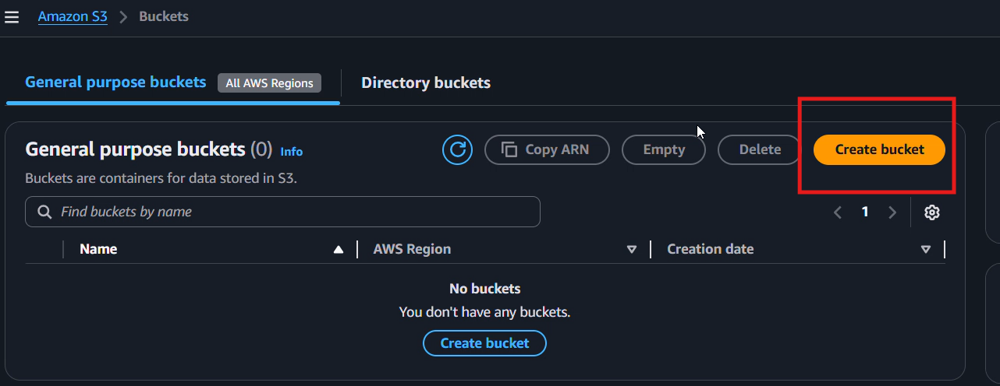

- Give it a unique name. (S3 bucket names must be globally unique). 
- 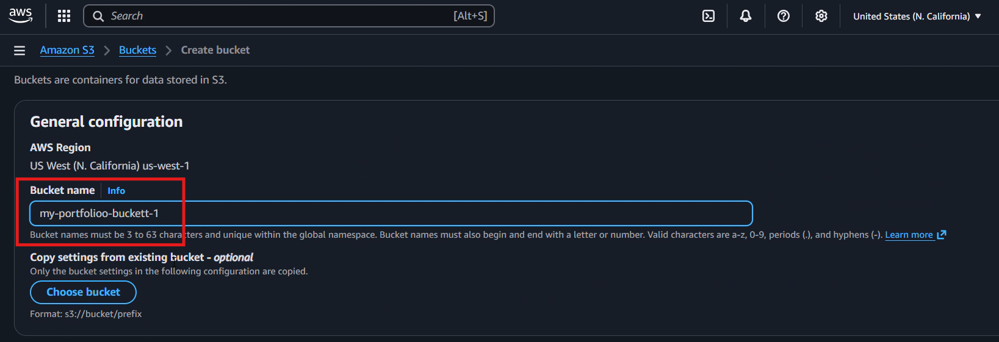

- Keep other settings default for now and create the bucket.
- 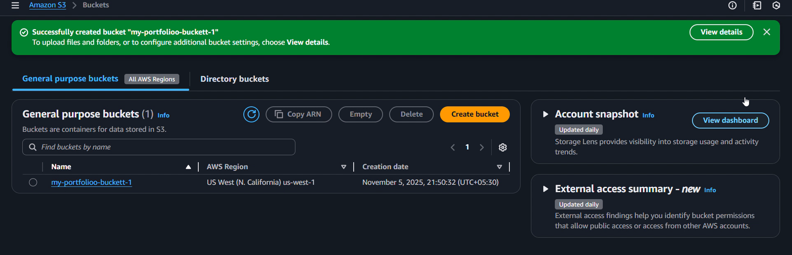

---

### Step 2. Upload Portfolio Files
Uploading files to S3 places your website content on AWS infrastructure so it can be accessed from anywhere in the world.

- Open your newly created bucket.
- 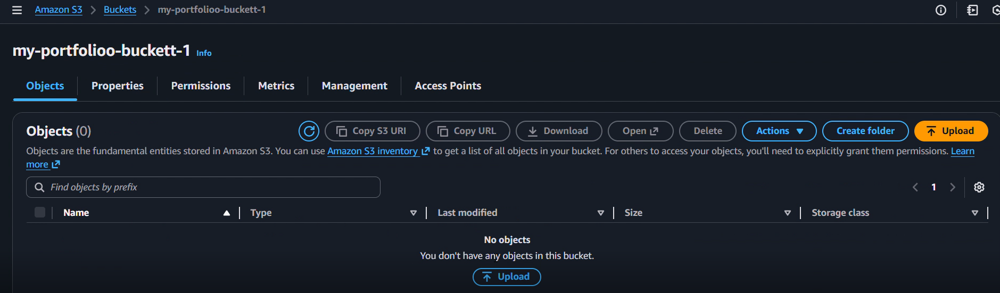
- Click **“Upload”** → **“Add files”**.
- Select all your files for the portfolio.
- Click **Upload**.
- 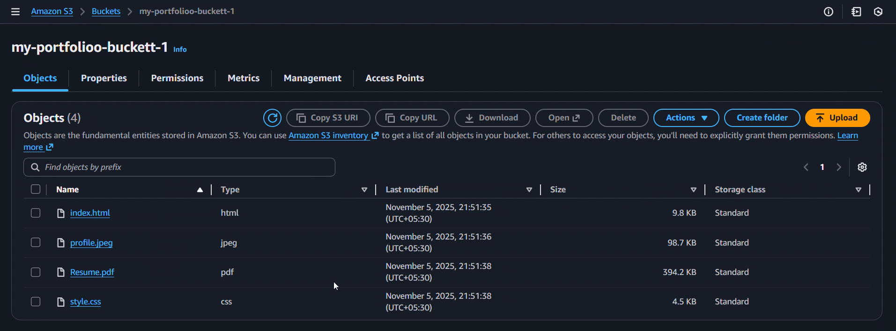

---

### Step 3. Make the Files Publicly Accessible
- Go to the **Permissions** tab.
- Turn **off** the “Block all public access” option.
- 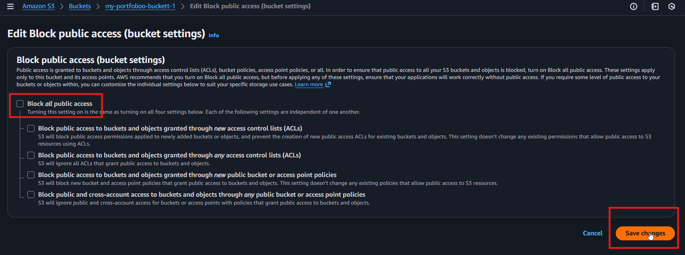
- Type Confirm for saving the changes.

By default, S3 keeps all files private. Turning this off allows the public to access your website files.

---

### Step 4. Enable Object Ownership (ACLs)
- In the same **Permissions** section:
  - Click **“Edit”** under **Object Ownership**.
  - Select **“ACLs enabled”**.
  - Check **“I acknowledge”** → **Save changes**.
  - 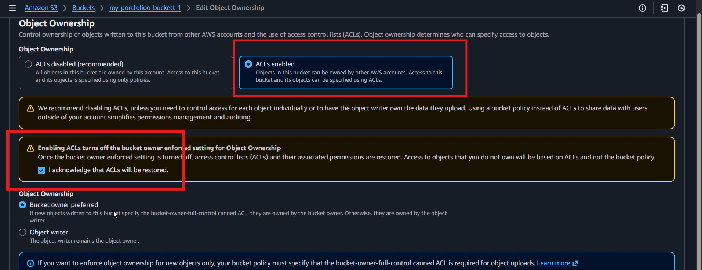

Enabling **ACLs (Access Control Lists)** allows you to manually make individual files public.

---

### Step 5. Make All Files Public
- Go back to your **Bucket**.
- Select all uploaded objects.
- Click **Actions → Make public using ACLs**
  - 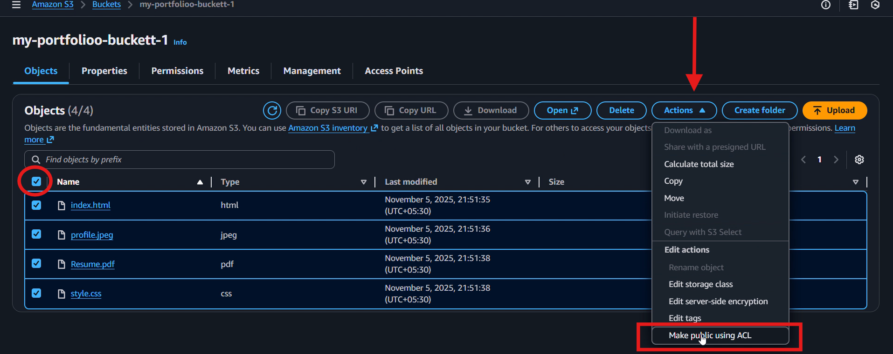
- Make public
  - 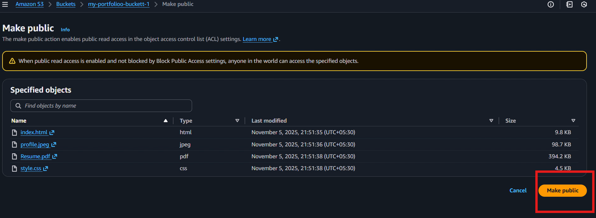

This step gives **read access** to everyone on the internet so your website resources (HTML, CSS, JS, images) can load properly.

---

### Step 6. Enable Static Website Hosting
This will convert your S3 bucket into a **static web server** that serves files through a web endpoint.

- Open the **Properties** tab.
- Scroll down to **Static website hosting** → **Edit**.
- 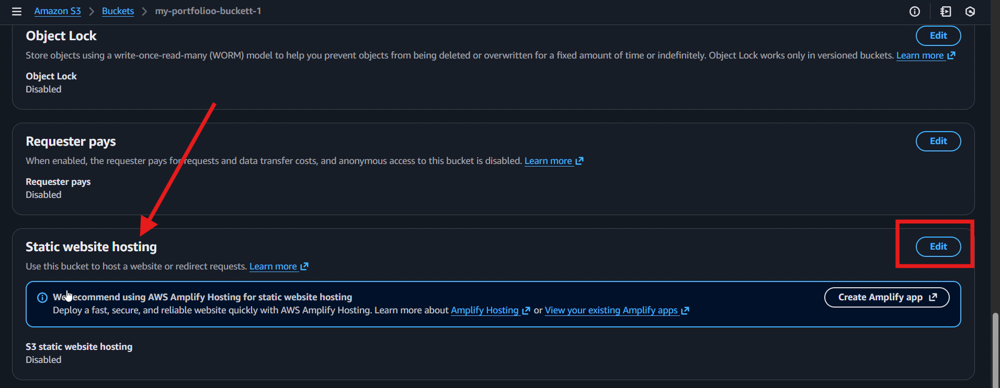
- Select **Enable**.
- Set the **Index document** to `index.html`.
- 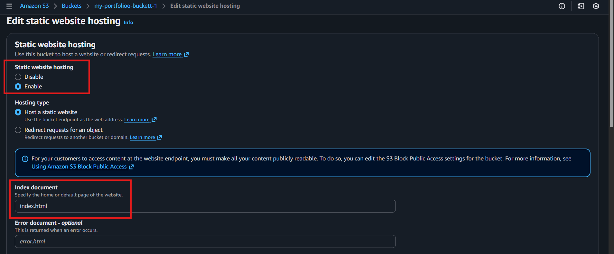
- Click **Save changes**.

---

### Step 7. Access the Website
- After saving, you’ll get a **Bucket Website Endpoint URL**.
- 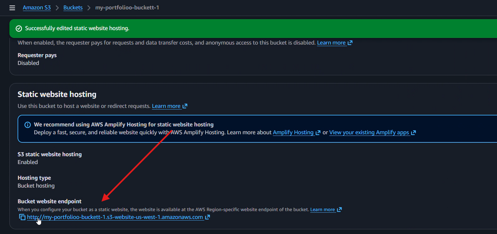
- Copy and paste this URL into your browser.
- Your **Portfolio Website** should now be live!
- 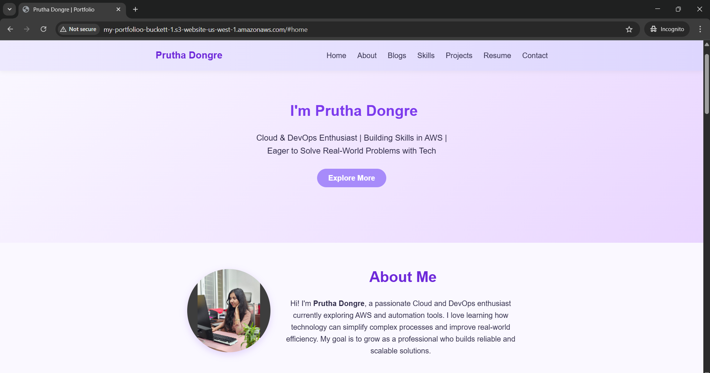

---

## ➤ Notes
- Ensure your bucket name is **globally unique**.
- S3 static hosting only supports **HTTP**, not HTTPS (unless integrated with **CloudFront**).
- To make it more professional, you can later:
  - Add a **custom domain** via **Route 53**.
  - Use **CloudFront** for HTTPS and caching.

---

## ➤ Troubleshooting

If your portfolio isn’t visible after deployment, check the following:

1. **Access Denied Error**
   - Ensure **“Block all public access”** is **disabled** in bucket permissions.
   - Verify objects are made **public using ACLs**.

2. **Accessing via Endpoint Shows XML Error**
   - Confirm that **Static Website Hosting** is **enabled** in **Properties**.
   - Check if **index document** is correctly set to `index.html`.

3. **Invalid URL or Page Not Found**
   - Verify you’re using the correct **Bucket Website Endpoint** (not the S3 object URL).

---

## ➤ Summary

Hosting a portfolio on **Amazon S3** is one of the easiest and most reliable ways to deploy a static website.  
It eliminates the need for complex backend servers while providing **high availability**, **scalability**, and **global reach** at minimal cost.  
By following a few simple steps—creating a bucket, uploading files, and enabling static website hosting—you can have your website live in minutes.  
This setup is perfect for personal projects, resumes, and portfolios that need to stay online 24/7 with zero maintenance.

---